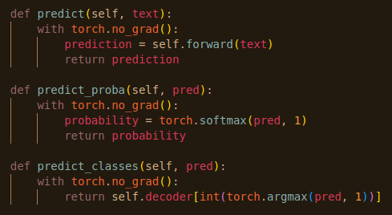

# aicore_facebook_ML

# Exploring the Dataset
Created two Python files to clean the Products.csv and Images. 

## Tabular Data
- Stripped the '£' sign and commas from the price column.
- Converted the price column into a float64 type.
- Converted the 'category' column type into the category column type. This is a numeric type under the surface and so is faster to use etc.
- Ran the `convert_dtypes` command on the remainder of the columns so that they were automatically converted into their optimum column types.

## Image Data
- Wrote the `clean_image_data` function which takes in the filepath of the images to be cleaned and then passes them to another function called `resize_image`. This function resizes the images to 512x512 pixels and also casts them as the RGB type of image. This means that they all have 3 channels as standard.
- The images are then saved by the `clean_image_data` in the cleaned_images directory.
- Wrote a small helper function `check_images` which simply loops through the cleaned images and checks that they're all of the correct size and all have 3 channels.

# Creating the Image Model
Created a Convolutional Neural Network (CNN) to categorise products based off their images. Then, used the pretrained ResNet-50 model instead to achieve better results by employing transfer learning.

## Creating the tranfer CNN
- The ResNet-50 model from Nvidia was used for the transfer learning.
- This classification problem has 13 different categories. By changing the final fully-connected layer of the ResNet-50 model, I was able to change it to start classifying products into one of these 13 different categories.

## Building the Training Loop
- The training function loops through each epoch, within which it loops over batches of data contained in the dataloaders, one for the training set, and one for the validation set.
- The model is trained and makes predictions during every batch of data from the dataloaders.
- The loss is also calculated during this time.

## Saving the model
- By using a validation set of data, I was able to calculate the accuracy of my models as they trained.
- Then, by keeping track of the best model iteration, I could save that best performing model after the program had looped through every epoch.

## Results
The results were visualised using tensorboard. Between each run I tweaked the model's hyperparameters, including the learning rate and batch size. Data augmentation was also applied to the input images to try and reduce the risk of overfitting, such as randomly flipping images and standardizing the images using their mean and standard deviation.
It's worth noting that the model overfitting was not overlooked at this stage. Knowing that the image model would be merged with the text model later, I chose to tackle any overfitting problems at that time instead.
- I used tensorboard to visualise the performance of the image model.
- The model could achieve a maximum of ~45% accuracy on the validation data, albeit with a large degree of overfitting on the data.
- This overfitting can be seen in the training loss converging towards 0 and the training accuracy reaching upwards of 90%, whilst the validation loss instead appeared to do nothing but increase over the training time.

# Creating the Text Model
Now it was time to attempt to categorise the products from their textual descriptions alone.

## Creating the Text Embeddings
Neural networks cannot analyse pure text data. Much like with images, the data has to be first converted into a numerical format, and that format for text is a word embedding. A word embedding is a term used for the representation of words for text analysis, typically in the form of a real-valued vector that encodes the meaning of the word such that the words that are closer in the vector space are expected to be similar in meaning.

- I decided to use BERT to create the text embeddings. https://huggingface.co/docs/transformers/model_doc/bert.
- Creating embeddings is done in two stages. First, you tokenize the text, and then you feed these tokens into a pretrained model to create the actual embeddings.
- I decided to tokenize the text within the `__getitem__` method of my TextDatabase. I did this because the tokens can be cast to tensors, and tensors can be loaded into memory by the GPU using the `.to(device)` command where device=cuda. This increases computation speed dramatically.
- For a similar reason, I kept the second stage of creating embeddings, the model, out of my `__getitem__` method and added it to my TextClassifier model as an attribute instead. This meant that I could load the whole model, including the BERT model, with my GPU too, which was an even more significant speed improvement.

Tokenizing the text in the TextDataset.

Applying the BERT model to the text tokens within the model.

At first, I was only including the products' descriptions when creating text embeddings. However, I realised that including the products' names would improve the model accuracy, since if a product is named something like 'Office Chair', the model will (hopefully) make the connection to the 'Office Furniture & Equipment' category.
As such, I combined the `product_name` and `product_description` columns of the dataset and creating the word embeddings from that combined column. I made sure to have the product's name at the front of this concatenation, in case the length of the text is truncated by the Bert Tokenizer.
Below is a comparison of training a model using the dataset with only product descriptions for word embeddings (grey), and a model trained on word embeddings created form the combined columns (orange).

## Training the Model
The training loop was almost exactly the same as the one used for the image classification. This time, however, I designed the neural network myself.

- I designed the model with five 'units'.
- The first four units consist of the same structure: a Convultional layer, Activation layer (ReLU), Max Pooling, and a Dropout layer.
- Max Pooling helps by calculating an abstracted form of the feature map, by summarising the features extracted by the convolutional layer. This aids in preventing over-fitting and also keeps computation time down.
- Dropout layers randomly set input units to 0 with a modifiable frequency, which helps prevent over-fitting.
- The final unit consists of a Flatten layer, which processes the inputs into one dimension, ready to be classfied; followed by one more Dropout layer; and finally the Linear layer takes in the inputs and outputs 13 numbers: a prediction for each category.

## Results
By tweaking the number of epochs, batch size, learning rate, and the probability parameter of the Dropout layers, I attempted to achieve the best results possible.

Firstly, I experimented with the learning rate.

- Learning rates: Red = 0.01, Blue = 0.001, Green = 0.0001.
- We can see that a learning rate of 0.0001 gave us no overfitting while maintaining a good degree of accuracy.

Then, the batch size.

- Batch sizes: Grey = 32, Orange = 64, Blue = 128.
- We can see that the differing batch sizes had little effect for the results of my model. As such, I decided to keep the batch size at 64.

After tweaking the hyperparameters and model structure, I arrived at a model with an accuracy on the validation data of 75%.

# Combining the Models
Now that I had succesfully classified products using their image and text data separately, it was time to combine the models to achieve a higher degree of accuracy.

## Creating the Image-Text Dataset
- I wrote a static method to merge the image and text data.
- By merging Products.csv and Images.csv using pandas, I could extract the products' image and text data by matching them together using their product id.
- I combined the `__getitem__` method from the image and text datasets to return all of the needed data.

## Creating the Model
- Similarly to the dataset, I simply imported the text classifier and image classifier that I's already written, and combined them in their own classifier class.
- By using a Liner layer, I combined the results of the text and image classifier to give the final prediction.

## Results
The combined model performed significantly better than the image and text models. Below is a graph showing how the combined model performed.

Below is a graph showing how the combined model (blue) performed against the text model (orange).

# Creating the API
I used FastAPI to make my image, text, and combined models available via API. Making a model available in this way is called 'model serving'.

## Creating the API
- All of the API endpoints were written in a single file, `api.py`.
- I started by rewriting my text, image, and combined models' strcutures in my api file so that they could be initialised.
- I added three additional methods to each of the models: `predict`, `predict_proba`, and `predict_classes`.

- The `predict` method simply runs the input through the model's `forward` method.
- The `predict_proba` method returns `torch.softmax` of the initial prediction.
- The `predict_classes` method firstly uses `torch.argmax` to find the most likely (largest) prediction's index made by `predict`, then uses the decoder.pkl file to return the actual (predicted) category of the product.

## Results
Using a test file, I made requests to the API's endpoints to obtain results.

Firstly, the text endpoint:

Image endpoint:

Combined model endpoint:

It's worth noting that I used short sentences when testing each endpoint coupled with a random image, hence the vastly different results from each endpoint.

